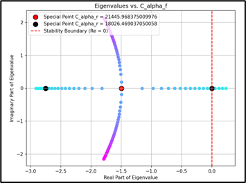
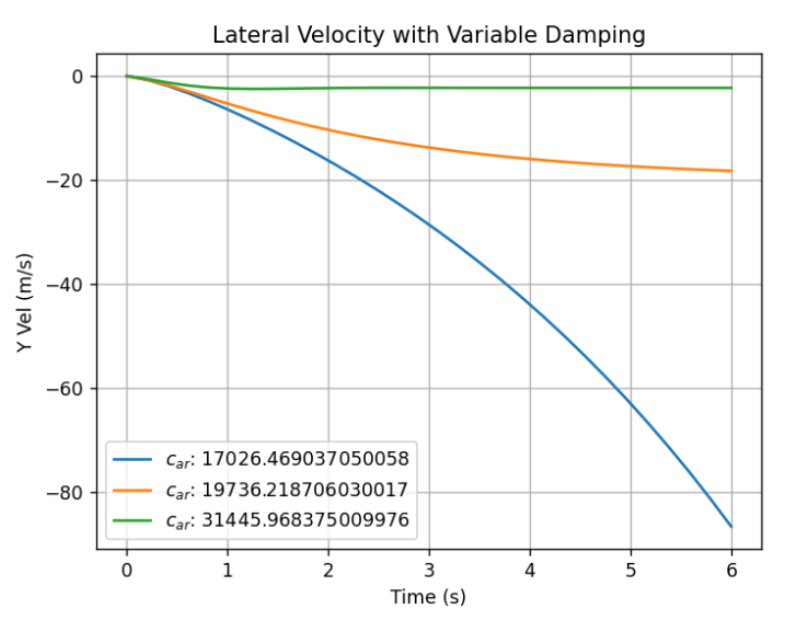

# Bicycle Model - Vehicle Dynamics

This project explores the dynamics of a bicycle model, commonly used in vehicle dynamics and control systems. The model simulates vehicle control under varous conditions, allow the user to tweak parameters to determine safe operation bounds. 

The findings for this exploration is avaliable [here](docs/report.pdf) in full

# Summary

### Model Parameters
1. Vehicle Mass: $m$
2. Tire stiffness (front and rear): $C_{\alpha r}$, $C_{\alpha f}$
3. Longitudinal velocity: $u$
4. Distance to center of mass from rear/front tires: $a$, $b$
5. Moment of inertia: $I_z$

### State Parameters
1. Lateral velocity $\dot{y}$
2. Yaw rate $\dot{\psi}$

### Assumptions
1. Both front wheels considered a single wheel, same for back wheels
2. Vehicle constraint to XY plane movement
3. Vehicle treated as a single rigid body for lateral and yaw motion
4. Lateral tire forces only (no longitudinal acceleration)
5. Small steering angle

From this 2-axis dynamics bicycle model with linear tire modellinng, we derived the governing matrix with respect to model parameters, such as mass, velocity, tire cornering stiffness, etc...

# Stability Definition
As our bicycle model can be fully described with the matrix system:

which can be equivalent viewed as a 2nd order ODE whose homogenous roots characterized by the eigenvalues of A. 

If 1 or more eigenvalue of A > 0: the solution (i.e. state as a function of time) will explode to infinity due to haveing a positive exponent. 
- **We define this to be "unstable".**

If both eigenvalues of A < 0: The state will asymtote towards a finite value. 
- **We define this to be "stable".**

If eigenvalues of A is complex: Oscillating behaviour
- **We define this to be "unstable".**

# Example: Varying Tire Cornering Stiffness

As front cornering stiffness varies, there is a boundary (in red) where instability occurs. As eigenvalues come in pairs, if either point in the pair crosses the red boundary onto the positive real axis, the vehicle will become impossible to control. 

Within the stable region, there is further divide between purely real and complex eigenvalues; purely **real eigenvalues result in overdamping** and **complex eigenvalues lead to oscillations**.

- Green line is an underdamped system with oscillations. 
- Orange line is an overdamped system without oscillations. 
- Blue is an unstable system. 