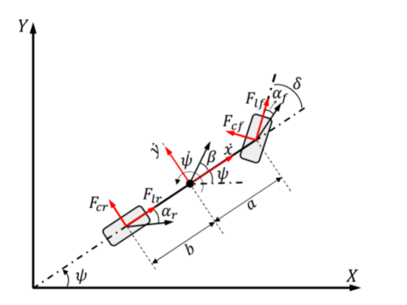

# Bicycle Model - Vehicle Dynamics

This project explores the dynamics of a bicycle model, commonly used in vehicle dynamics and control systems. The model simulates vehicle control under varous conditions, allow the user to tweak parameters to determine safe operation bounds. 

This project was conducted as a part of ME 303 - Advanced Calculus. The report for the project is avaliable [here](docs/report.pdf)

