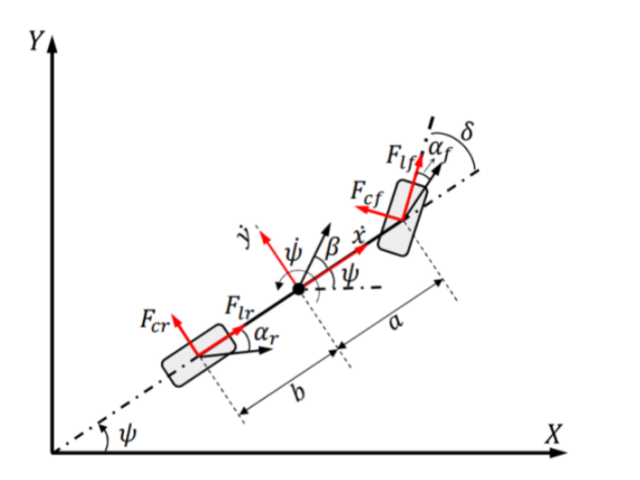
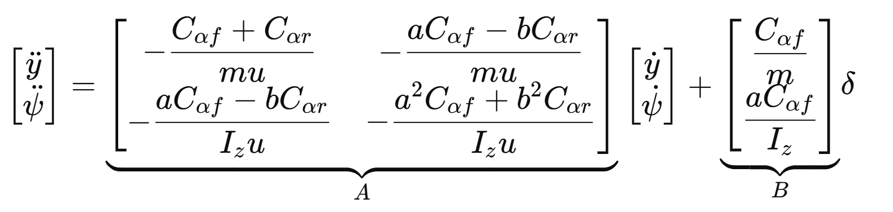

# Bicycle Model - Vehicle Dynamics

This project explores the dynamics of a bicycle model, commonly used in vehicle dynamics and control systems. The model simulates vehicle control under varous conditions, allow the user to tweak parameters to determine safe operation bounds. 

The findings for this exploration is avaliable [here](docs/report.pdf) in full

# Summary

From this 2-axis bicycle model with tire traction, we derived the governing matrix with respect to model parameters, such as mass, velocity, tire cornering stiffness, etc...

## Stability Definition
As our bicycle model can be fully described with the matrix system:

which can be equivalent viewed as a 2nd order ODE whose homogenous roots characterized by the eigenvalues of A. 

If 1 or more eigenvalue of A > 0: the solution (i.e. state as a function of time) will explode to infinity due to haveing a positive exponent. 
- **We define this to be "unstable".**

If both eigenvalues of A < 0: The state will asymtote towards a finite value. 
- **We define this to be "stable".**

### Example: Varying Tire Traction

As front cornering stiffness varies, there is a boundary (in red) where instability occurs. As eigenvalues come in pairs, if either point in the pair crosses the red boundary onto the positive real axis, the vehicle will become impossible to control.

